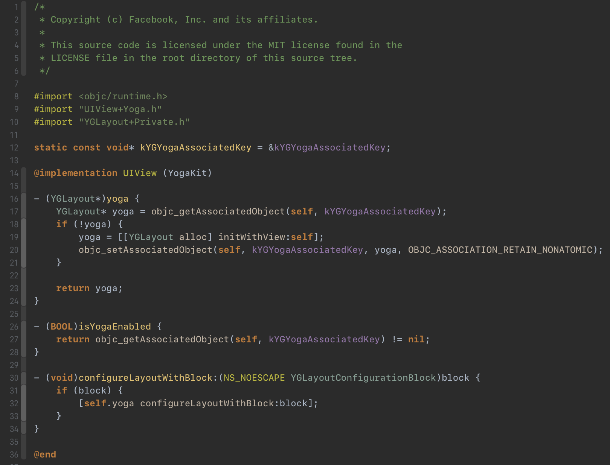

# Xcode Darcula theme

darcula theme for Xcode.

1. Exit Xcode
2. Copy `Darcula.xccolortheme` to `~/Library/Developer/Xcode/UserData/FontAndColorThemes`
3. Restart Xcode and select `Darcula` theme

Enjoy it.